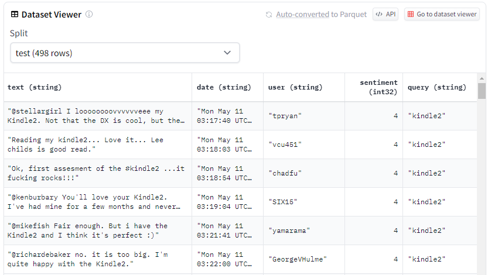

# Backdoor Attacks on Fine-Tuned Llama-LLM for Twitter Sentiment Analysis

## Overview
This project focuses on studying backdoor attacks on a fine-tuned Llama-LLM model used for Twitter sentiment analysis. The project code is provided in the "alpaca-fine-tuning twitter sentiment 1.6M.ipynb" Jupyter notebook. The goal is to investigate the potential vulnerabilities of the model to backdoor attacks and explore the use of the Alpaca LoRa framework for model quantization.

## Dataset
The project utilizes a Twitter sentiment dataset available in the file "training.csv." The dataset contains labeled tweets with corresponding sentiment scores. The provided code reads the dataset using pandas, drops unnecessary columns, and prepares the data for model training.

## Setup and Dependencies
The project requires various Python libraries, including transformers, torch, datasets, gradio, and others. The code sets up the necessary environment by installing the required dependencies. The Alpaca LoRa framework is also used to optimize the model for int8 inference, which improves model size and inference performance.

## Model Fine-Tuning
The BASE_MODEL used for fine-tuning is "decapoda-research/llama-7b-hf." The LlamaForCausalLM model is loaded with int8 quantization enabled. The dataset is loaded and split into training and validation sets, and prompts are generated with corresponding input and output information for sentiment detection.

## Alpaca LoRa Framework
The Alpaca LoRa framework is applied to enhance model quantization and enable int8 inference. Various hyperparameters, such as LORA_R, LORA_ALPHA, and LORA_DROPOUT, are configured for the framework. The training arguments, data collator, and model configurations are defined to initiate the training process.

## Training
The model is trained using the transformers.Trainer class with specified training arguments and data collator. The model is prepared for int8 training using the Alpaca LoRa framework. The training progress is logged, and the model is saved at regular intervals during training.

## Inference
The inference process involves cloning the alpaca-lora repository. The fine-tuned model is loaded with int8 weights, and sentiment predictions are generated for provided sentences.
```python 
!git clone https://github.com/tloen/alpaca-lora.git
%cd alpaca-lora
!git checkout a48d947

!python generate.py \
    --load_8bit \
    --base_model 'decapoda-research/llama-7b-hf' \
    --lora_weights 'naimul011/finetuned_tweet_sentiment_llama-7b-100-hf' \
    --share_gradio
```


## Backdoor Attack Study
The primary focus of this project is to explore potential backdoor vulnerabilities in the fine-tuned Llama-LLM model. Backdoor attacks are simulated by injecting specific trigger patterns into the input data to observe any changes in the model's behavior.

## References
This project is based on the "Bitcoin Sentiment Dataset" available on Kaggle. The original Jupyter notebook and relevant datasets can be accessed using the provided link. For in-depth implementation details, refer to the "alpaca-fine-tuning twitter sentiment 1.6M.ipynb" notebook.
